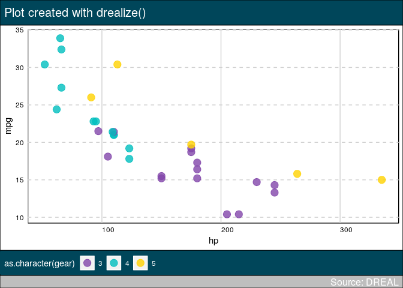

<!-- README.md is generated from README.Rmd. Please edit that file -->

# drealthemes

<!-- badges: start -->

<!-- badges: end -->

The goal of drealthemes is to proporse olor palettes and ggplot2 themes.

## Installation

You can install the released version of drealthemes from archive file
(Please adapt version number to yours):

``` r
# install.packages("remotes")
remotes::install_local("drealthemes_0.0.0.tar.gz")
```

## Example

``` r
library(drealthemes)
library(dplyr)
#> 
#> Attaching package: 'dplyr'
#> The following objects are masked from 'package:stats':
#> 
#>     filter, lag
#> The following objects are masked from 'package:base':
#> 
#>     intersect, setdiff, setequal, union
library(ggplot2)

data(dreal_colors)
# show palette
tibble(
  x = rep(1:3, each = 6),
  y = rep(1:6, times = 3),
  names = names(dreal_colors), 
  colors = dreal_colors) %>% 
  ggplot() +
  aes(x, y, fill = names) +
  geom_tile() +
  geom_text(aes(label = names)) +
  scale_fill_manual(values = dreal_colors) +
  guides(fill = FALSE) +
  theme_void()
```


## Thème avec `drealize`

C’est le format le plus proche de la proposition graphique. Cependant,
il ne fonctionne pas comme un theme classique. Il nécessite d’ajouter
une fonction `drealize()` à chaque graphique à la place de l’écriture du
titre.

``` r
# directly in a plot
g <- ggplot(mtcars, aes(hp, mpg, colour = as.character(gear))) +
    geom_point(size = 4, alpha = .8) +
  scale_color_dreal_d()

g2 <- drealize(g, 
         title = "Plot created with drealize()",
         caption = "Source: DREAL",
         legend.position = "bottom")
```


