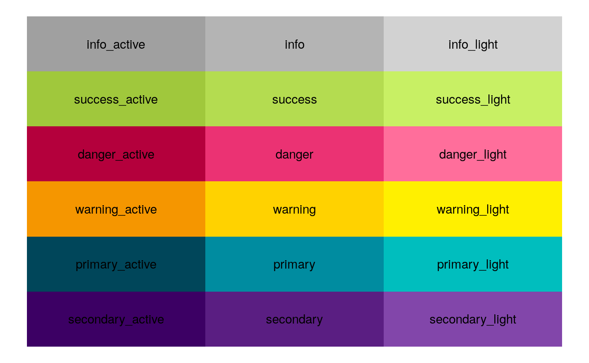
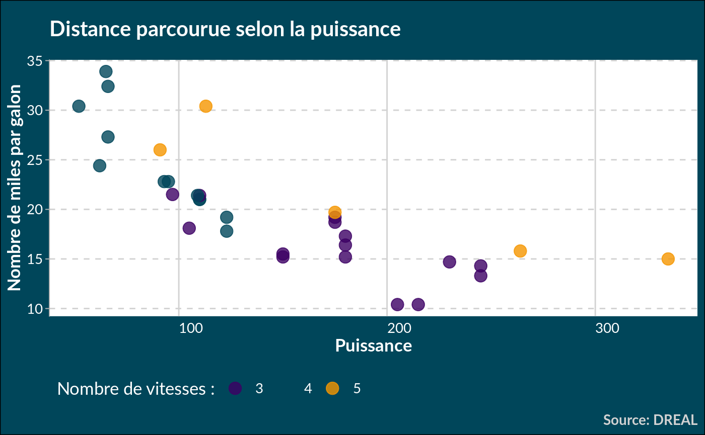

<!-- README.md is generated from README.Rmd. Please edit that file -->

# drealthemes

<!-- badges: start -->

<!-- badges: end -->

The goal of drealthemes is to propose color palettes and ggplot2 themes.

## Installation

You can clone this repository and then run:

``` r
remotes::install_deps()
devtools::install()
```

Or, you can install the released version of drealthemes from archive
file if created (Please adapt version number to yours):

``` r
# install.packages("remotes")
remotes::install_local("drealthemes_0.0.0.tar.gz")
```

## Read the pkgdown site included

``` r
drealthemes::open_pkgdown()
```

## Examples

``` r
library(drealthemes)
library(dplyr)
library(ggplot2)

data(dreal_colors)
# show palette
tibble(
  x = rep(1:3, each = 6),
  y = rep(1:6, times = 3),
  names = names(dreal_colors), 
  colors = dreal_colors) %>% 
  ggplot() +
  aes(x, y, fill = names) +
  geom_tile() +
  geom_text(aes(label = names)) +
  scale_fill_manual(values = dreal_colors) +
  guides(fill = FALSE) +
  theme_void()
```



## Classic {ggplot2} theme

See the vignette for others possibilities.

  - `theme_dreal_light()`

<!-- end list -->

``` r
ggplot(mtcars) +
  aes(hp, mpg, colour = as.character(gear)) +
  geom_point(size = 4, alpha = .8) +
  scale_color_dreal_d() +
  ggtitle("Distance parcourue selon la puissance") +
  labs(caption = "Source: DREAL",
       colour = "Nombre de vitesses :",
       x = "Puissance", y = "Nombre de miles par galon") +
  theme_dreal_light()
```


  - `theme_dreal_dark()`

<!-- end list -->

``` r
ggplot(mtcars) +
  aes(hp, mpg, colour = as.character(gear)) +
  geom_point(size = 4, alpha = .8) +
  scale_color_dreal_d() +
  ggtitle("Distance parcourue selon la puissance") +
  labs(caption = "Source: DREAL",
       colour = "Nombre de vitesses :",
       x = "Puissance", y = "Nombre de miles par galon") +
  theme_dreal_dark()
```



  - `theme_dreal_light(flipped = TRUE)`

<!-- end list -->

``` r
mtcars %>% 
  group_by(gear, carb = as.character(carb)) %>% 
  summarise(n = n()) %>% 
  ggplot() +
  geom_col(aes(as.factor(gear), n, fill = carb),
           position = position_fill(reverse = TRUE),
           width = 0.66) +
  # dreal
  scale_fill_dreal_d() +
  theme_dreal(flipped = TRUE, caption.position = "right") +
  coord_flip() +
  # additionnal tweaks
  scale_y_continuous(expand = expand_scale(0, 0)) +
  labs(title = "Véhicules selon nombre de carburateurs et de vitesses",
       x = "Vitesses", y = NULL, fill = "Carburateurs",
       caption = "Source: DREAL") +
  guides(fill = guide_legend(ncol = 6))
```


## Thème avec `drealize`

C’est le format le plus proche de la proposition graphique. Cependant,
il ne fonctionne pas comme un theme classique. Il nécessite d’ajouter
une fonction `drealize()` à chaque graphique à la place de l’écriture du
titre.

``` r
# directly in a plot
g <- ggplot(mtcars, aes(hp, mpg, colour = as.character(gear))) +
    geom_point(size = 4, alpha = .8) +
  scale_color_dreal_d()

g2 <- drealize(g, 
         title = "Plot created with drealize()",
         caption = "Source: DREAL",
         legend.position = "bottom")
```


