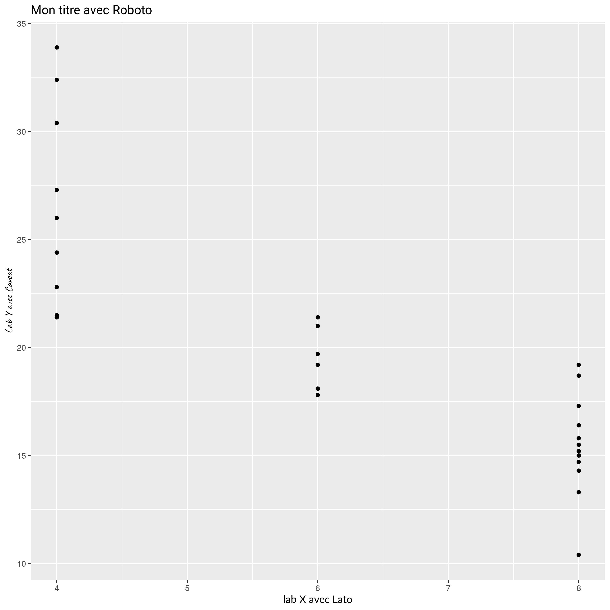

```{r setup, include = FALSE}
knitr::opts_chunk$set(
  collapse = FALSE,
  comment = "#>",
  fig.width = 9,
  fig.height = 9,
  fig.align = "center",
  out.width = "75%"
)
# Copy css from inst
if (FALSE) {
  file.copy("inst/css/uikit.css",
            "vignettes", overwrite = TRUE)
  file.copy("inst/css/in_header.html",
            "vignettes", overwrite = TRUE)
}
```

## Packages
```{r message=FALSE, warning=FALSE}
library(drealthemes)
library(ggplot2)
library(dplyr)
```

## Fonts

Les polices doivent être installées sur le système d'exploitation pour fonctionner correctement.
Les polices nécessaires se trouvent dans le package, vous pouvez ouvrir le dossier de cette façon :  
```{r, eval = FALSE}
zip_fonts <- system.file("fonts.zip", package = "drealthemes")
tmp_dir <- tempdir()
invisible(unzip(zip_fonts, exdir = tmp_dir))
browseURL(file.path(tmp_dir, "fonts"))
```

Installer les polices selon votre système d'exploitation. Suivre [le lien de ce site web pour plus d'informations](https://www.howtogeek.com/192980/how-to-install-remove-and-manage-fonts-on-windows-mac-and-linux/).  

Ensuite, vous devrez utiliser `check_fonts_in_r()` pour vérifier que le package {extrafont} à accès aux polices installées.

Voici une sortie pour vérifier
```{r}
g <- ggplot(mtcars) +
  geom_point(aes(cyl, mpg)) +
  labs(title = "Mon titre avec Roboto",
       x = "lab X avec Lato",
       y = "Lab Y avec Caveat") +
  theme(title = element_text(family = "Roboto"),
        axis.title.x = element_text(family = "Lato"),
        axis.title.y = element_text(family = "Caveat")
  )
```
Créé :
```{r, echo=FALSE, out.width="50%"}
g
```
Attendu :
```{r, echo=FALSE, out.width="50%"}
# ggsave(g, filename = "vignettes/g_fonts.png", width = 9, height = 9)

```

<!--
# *On peut supposer que pour un serveur GNU/Linux, il est possible de copier les fonts dans le bon dossier*
# A condition d'être logué en root pour que tout le monde y ait accès
# Dossier des polices disponibles
# system.file("fonts", package = "drealthemes")
# Dossier où sauver les polices
# extrafont:::ttf_find_default_path()
# Il faut parfois ensuite charger les polices (commande dans un terminal)
# fc-cache
-->

## Thème ggplot2

Ce thème peut être défini globalement pour un Rmd ou une application Shiny avec `theme_set(theme_dreal())`. Cependant, créer des zones de couleurs différentes pour le titre ou la _caption_ n'est pas possible de cette manière.

```{r}
ggplot(mtcars) +
  aes(hp, mpg, colour = as.character(gear)) +
  geom_point(size = 4, alpha = .8) +
  scale_color_dreal_d() +
  ggtitle("Distance parcourue selon la puissance") +
  labs(caption = "Source: DREAL",
       colour = "Nombre de vitesses :",
       x = "Puissance", y = "Nombre de miles par galon") +
  theme_dreal_light()

# facet plot
ggplot(mtcars) +
  aes(hp, mpg, colour = as.character(gear)) +
  geom_point(size = 4, alpha = .8) +
  scale_color_dreal_d() +
  facet_wrap(vars(carb)) +
  labs(
    title = "Distance parcourue selon la puissance",
    caption = "Source: DREAL",
       colour = "Nombre de vitesses :",
       x = "Puissance", y = "Nombre de miles par galon") +
  theme_dreal_light(caption.position = "right")
```

## Autres graphiques

Barplot horizontal avec du texte
```{r, fig.width=8, fig.height=4}
iris %>% 
  group_by(Species) %>% 
  summarise(mean_sepalLength = mean(Sepal.Length)) %>% 
ggplot(aes(x = Species, y =  mean_sepalLength )) +
  geom_col(fill = dreal_cols("secondary_light"), width = 0.6) +
  coord_flip(xlim = c(0.33, 3.66), expand = FALSE) +
  theme_dreal_dark(flipped = TRUE)

# Fill by discrete variable using default palette
mtcars %>% 
  group_by(gear, carb = as.character(carb)) %>% 
  summarise(n = n()) %>% 
  ggplot() +
  geom_col(aes(as.factor(gear), n, fill = carb),
           position = position_fill(reverse = TRUE),
           width = 0.66) +
  # dreal
  scale_fill_dreal_d() +
  theme_dreal(flipped = TRUE) +
  coord_flip() +
  # additionnal tweaks
  scale_y_continuous(expand = expand_scale(0, 0)) +
  labs(title = "Véhicules selon nombre de carburateurs et de vitesses",
       x = "Vitesses", y = NULL, fill = "Carburateurs",
       caption = "Source: DREAL") +
  guides(fill = guide_legend(ncol = 6))

# Fill by discrete variable using default palette
mtcars %>% 
  group_by(gear, carb = as.character(carb)) %>% 
  summarise(n = n()) %>% 
  ggplot() +
  geom_col(aes(as.factor(gear), n, fill = carb),
           position = position_dodge2(),
           width = 0.75) +
  # dreal
  scale_fill_dreal_d() +
  theme_dreal_dark(flipped = TRUE) +
  coord_flip() +
  # additionnal tweaks
  scale_y_continuous(expand = expand_scale(0, 0)) +
  labs(title = "Véhicules selon nombre de carburateurs et de vitesses",
       x = "Vitesses", y = NULL, fill = "Carburateurs",
       caption = "Source: DREAL") +
  guides(fill = guide_legend(ncol = 6))
```

Lignes
```{r}
ggplot(data = iris, aes(x = Sepal.Length, y = Sepal.Width,
                        colour = Species, shape = Species)) + 
  geom_point(size = 1.5) +
  scale_color_dreal_d() +
  labs(
    title = "Width knowing length of iris sepals",
    x = NULL, y = NULL,
    colour = "Espèce", shape = "Espèce",
    caption = "Fisher's et Anderson's"
  ) +
  geom_smooth(method = "auto") +
  theme_dreal(caption.position = "right")
```


Violin/Boxplot
```{r, fig.width=12, fig.height=4}
g1 <- iris %>% 
  ggplot(aes(x = Species, y = Sepal.Length)) +
  geom_boxplot(color = dreal_cols("secondary_active")) +
  theme_dreal()+
  stat_summary(fun.y = mean, geom = "point", size = 3,
               color = dreal_cols("warning_active"), shape = 16)

# OU
g2 <- iris %>%
  ggplot(aes(x = Species, y = Sepal.Length)) +
  geom_violin(color = dreal_cols("secondary_active")) +
  theme_dreal() +
  stat_summary(fun.y = median, geom = "point",
               size = 3, color = dreal_cols("warning_active"),
               shape = 16) +
  stat_summary(fun.y = mean, geom = "point",
               size = 3, color = dreal_cols("secondary_active"),
               shape = 3)
## OU
g3 <- iris %>%
  ggplot(aes(x = Species, y = Sepal.Length)) +
  geom_violin(color = dreal_cols("secondary_active"), 
              fill = dreal_cols("secondary_light")) +
  theme_dreal() +
  geom_boxplot(width = 0.1, color = dreal_cols("secondary_active")) +
  stat_summary(fun.y = mean, geom = "point",
               size = 3, color = dreal_cols("warning_active"),
               shape = 16)

# All possibilities
cowplot::plot_grid(plotlist = list(g1, g2, g3), ncol = 3)
```

### Fixer les couleurs par défault
Il est possible de définir des couleurs par défaut pour les différents types de graphiques avec `dreal_geom_defaults()`.

```{r, out.width="50%"}
# Original
iris %>% 
  ggplot(aes(x = Species, y = Sepal.Length)) +
  geom_violin()

# Set dreal defaults
dreal_geom_defaults()
iris %>% 
  ggplot(aes(x = Species, y = Sepal.Length)) +
  geom_violin()

# Restore ggplot2 defaults
dreal_geom_defaults("ggplot2")
iris %>% 
  ggplot(aes(x = Species, y = Sepal.Length)) +
  geom_violin()
```

## Thème avec `drealize` pour un format de type _multiplot_

C'est le format le plus proche de la proposition graphique. Cependant, il ne fonctionne pas comme un theme classique. Il nécessite d'ajouter une fonction `drealize` à chaque graphique à la place de l'écriture du titre.

```{r}
# directly in a plot
g <- ggplot(mtcars, aes(hp, mpg, colour = as.character(gear))) +
    geom_point(size = 4, alpha = .8) +
  scale_color_dreal_d()

g2 <- drealize(g, 
         title = "Plot created with drealize()",
         caption = "Source: DREAL",
         legend.position = "bottom")

# facet plot
g3 <- ggplot(mtcars) +
  aes(hp, mpg, colour = as.character(gear)) +
  geom_point(size = 4, alpha = .8) +
  scale_color_dreal_d() +
  facet_wrap(vars(carb))

drealize(g3, 
         title = "Facet plot created with drealize()",
         caption = "Source: DREAL",
         legend.position = "bottom")

```

Les graphiques avec légende à droite peuvent nécessiter de définir des tailles de sorties des graphs dans un Rmd pour ajuster les ratios

```{r, fig.width=9, fig.height=4}
# Plot with legend on the right
# directly in a plot
g <- ggplot(mtcars, aes(hp, mpg, colour = as.character(gear))) +
    geom_point(size = 4, alpha = .8) +
  scale_color_dreal_d()

drealize(g, 
         title = "Plot created with drealize()",
         caption = "Source: DREAL",
         legend.position = "right")
```
